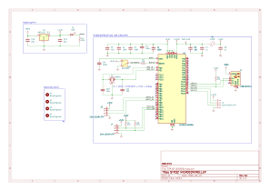
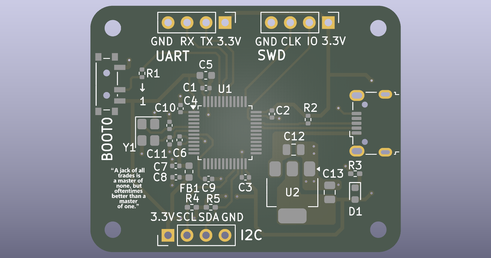
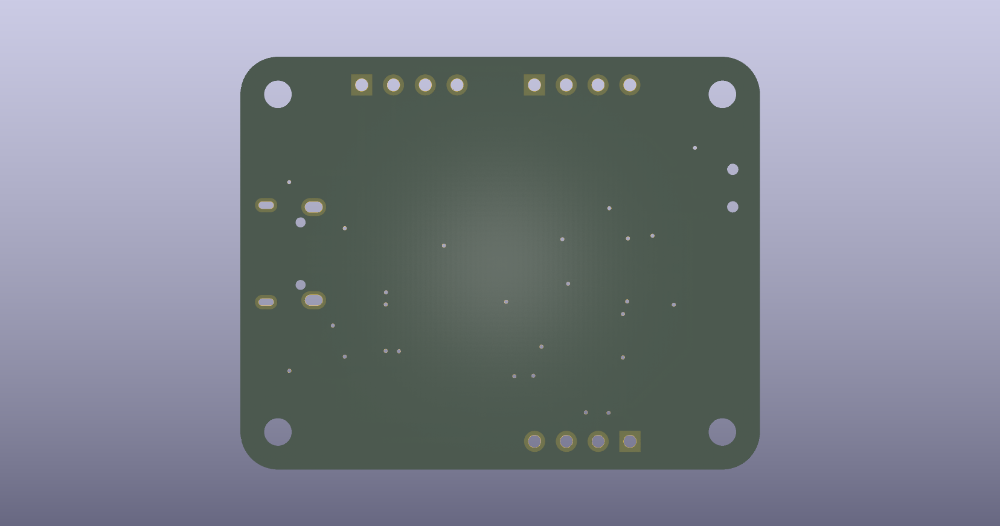
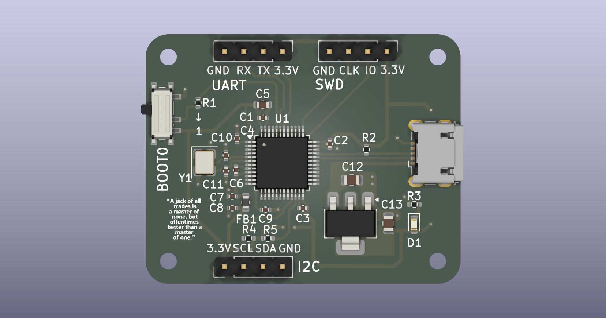

# STM32F103C8T6 Custom PCB

A custom-designed 2-layer development board built around the STM32F103C8T6 (Arm Cortex-M3), featuring USB, UART, I2C, and SWD interfaces. Designed from schematic to manufacturing files in KiCad, inspired by Phil's Lab's PCB design tutorials.

## Table of Contents

- [Overview](#overview)
- [Features](#features)
- [Schematic](#schematic)
- [PCB Layout](#pcb-layout)
- [Pin Configuration](#pin-configuration)
- [Programming the Board](#programming-the-board)
- [Bill of Materials](#bill-of-materials)
- [Manufacturing Files](#manufacturing-files)
- [Design Decisions](#design-decisions)
- [Future Improvements](#future-improvements)
- [License](#license)

## Overview

This repository documents the complete design process of a custom STM32F103C8T6-based PCB, from schematic capture through PCB layout to manufacturing-ready Gerber files. The project was built as a hands-on learning exercise in embedded hardware design, covering power regulation, USB connectivity, debug/programming interfaces, and signal integrity considerations on a 2-layer board.

## Features

- **MCU:** STM32F103C8T6 (Arm Cortex-M3, 72MHz, 64KB Flash, 20KB RAM)
- **USB 2.0 Full-Speed** connectivity via onboard Micro USB-B connector
- **Three programming/flashing methods:**
  - SWD (Serial Wire Debug) via ST-Link for flashing + live debugging
  - UART bootloader (via broken-out USART1 header)
  - USB DFU bootloader (native USB, no extra hardware required)
- **I2C2 interface** broken out via header for external sensors/peripherals
- **UART1 interface** broken out via header for serial communication/debugging
- **Manual BOOT0 selector switch** for toggling between application and bootloader mode
- **Onboard 3.3V regulation** via AMS1117-3.3 LDO from USB VBUS
- **16MHz crystal oscillator** with calculated load capacitance for accurate clock generation
- **Dedicated analog supply (VDDA)** isolated via ferrite bead for clean ADC performance
- **Solid ground plane** (bottom layer) with thermal-relief pad connections for reliable hand-soldering
- **4x mounting holes** for enclosure/standoff compatibility

## Schematic

The schematic is organized into four functional blocks: power supply, microcontroller core, USB circuitry, and external interface headers.

### Power Supply

- VBAT and all VDD pins are individually decoupled with 100nF capacitors, placed close to each pin to minimize trace inductance and provide a low-impedance path for high-frequency switching noise.
- A 10µF bulk capacitor sits in parallel to handle larger transient current demands.
- VDDA (analog supply) is isolated from the digital 3.3V rail using a 120Ω ferrite bead, preventing digital switching noise from corrupting ADC readings. Three additional decoupling capacitors support this analog rail.
- A AMS1117-3.3 LDO regulates incoming USB VBUS (5V) down to a clean 3.3V rail for the entire board.

### Reset and Boot Configuration

- **NRST** is decoupled with a 100nF capacitor to filter transient noise; no manual reset switch is present in this revision (see [Future Improvements](#future-improvements)).
- **BOOT0** is pulled low through a 10kΩ resistor by default (normal application boot), with a SPDT switch (SW1) allowing manual selection of bootloader mode for flashing.

### Oscillator

- A 16MHz crystal (Y1) provides the system clock, with load capacitors (C10, C11) calculated from the crystal's specified load capacitance, accounting for PCB trace and pin stray capacitance.

### Communication Interfaces

- **USART1** broken out to a 4-pin header (GND, RX, TX, 3.3V) for general-purpose serial communication.
- **I2C2** (SCL/SDA) broken out to a 4-pin header, with 1.5kΩ pull-up resistors on both lines (required since I2C is an open-drain bus).

### USB Circuitry

- Micro USB-B connector provides VBUS for power and D+/D- for USB Full-Speed data.
- D+ is pulled high through a 1.5kΩ resistor, signaling to the host that this is a Full-Speed USB device during enumeration.

### Debug Interface

- SWD (SWDIO, SWCLK) broken out to a 4-pin header (GND, CLK, IO, 3.3V) for programming and live debugging via ST-Link.

## PCB Layout

The board is a 2-layer design (F.Cu / B.Cu) measuring 41.5mm x 33mm, laid out in KiCad.

### Layer Stack

| Layer | Purpose |
|---|---|
| F.Cu (Top) | Signal routing, component placement |
| B.Cu (Bottom) | Solid ground plane (filled zone) |

### Trace Widths

| Net Type | Width | Rationale |
|---|---|---|
| Signal (I2C, UART, GPIO) | 0.3mm | Standard for logic-level signals; current is negligible, width chosen for routability |
| Power / Ground | 0.5mm | Comfortable margin above required ampacity (board draws well under 200mA) |

### Ground Plane Configuration

- **Fill zone:** B.Cu layer, solid ground pour
- **Clearance:** 0.3mm
- **Minimum width:** 0.25mm
- **Pad connection:** Thermal relief (both gap and spoke width = 0.5mm) — chosen over solid/direct connection to keep pads hand-solderable without excessive heat sinking into the copper pour

### Via Sizing

- **Standard vias:** 0.7mm
- **3.3V power vias:** 0.75mm

Via sizes were chosen conservatively (larger than minimum fab capability) to prioritize manufacturing reliability and ease of hand-soldering/rework over board density, appropriate for a learning-focused first PCB project.

### Layout Considerations

- **UART and USB separation:** USART1 was deliberately routed to the top-side header (PB6/PB7) rather than its default pins (PA9/PA10), which sit immediately adjacent to the USB D+/D- lines (PA11/PA12). This reduces the risk of crosstalk between the UART signals and the USB differential pair.
- **Decoupling capacitor placement:** All decoupling capacitors are placed as close as possible to their respective VDD/VSS pin pairs to minimize loop inductance.
- **USB differential pair routing:** D+/D- are routed as a tight, closely-coupled pair into the host detection pull-up network before reaching the MCU.
- **Regulator copper area:** The AMS1117 (U2) is given adjacent copper pour on the 3.3V net to assist with passive heat dissipation.

## Pin Configuration

| Function | Pin(s) | Notes |
|---|---|---|
| USART1 (TX/RX) | PB6 (TX), PB7 (RX) | Moved from default PA9/PA10 to avoid proximity to USB lines |
| I2C2 (SCL/SDA) | PB10 (SCL), PB11 (SDA) | 1.5kΩ pull-ups on both lines |
| USB | PA11 (D-), PA12 (D+) | D+ pulled high via 1.5kΩ for Full-Speed device detection |
| SWD | PA13 (SWDIO), PA14 (SWCLK) | Programming and debugging via ST-Link |
| BOOT0 | Pin 44 | Pulled low via 10kΩ by default; SPDT switch allows manual high selection |
| NRST | Pin 7 | Decoupled with 100nF capacitor; no manual reset switch in this revision |
| OSC_IN / OSC_OUT | PD0, PD1 | 16MHz external crystal with calculated load capacitors |
| VDD / VSS | Multiple pins | Individually decoupled with 100nF capacitors + 10µF bulk capacitor |
| VDDA / VSSA | Analog supply pins | Isolated via 120Ω ferrite bead from digital 3.3V rail |

## Programming the Board

This board supports three independent methods for flashing firmware, offering flexibility depending on available hardware.

### Method 1: SWD (recommended for development)

**Requires:** ST-Link V2 programmer/debugger

1. Connect ST-Link to the SWD header (GND, CLK, IO, 3.3V)
2. Flash and debug directly from STM32CubeIDE, or via STM32CubeProgrammer
3. Supports full live debugging — breakpoints, register/variable inspection, step execution

This is the only method that supports real-time debugging, not just flashing.

### Method 2: UART Bootloader

**Requires:** USB-to-TTL serial adapter

1. Set **BOOT0 = HIGH** using SW1
2. Connect the adapter to the UART1 header (GND, RX, TX, 3.3V) — cross TX/RX between board and adapter
3. Power cycle the board (no manual reset switch in this revision)
4. Flash using STM32CubeProgrammer (UART connection mode) or compatible tools
5. Set **BOOT0 = LOW**, power cycle again to boot the new application

### Method 3: USB DFU Bootloader

**Requires:** Micro USB-B cable only (no extra hardware)

1. Set **BOOT0 = HIGH** using SW1
2. Connect the board via USB — it enumerates as a DFU device
3. **Windows only:** install a WinUSB driver using [Zadig](https://zadig.akeo.ie/) (one-time setup)
4. Flash using `dfu-util` or STM32CubeProgrammer (USB connection mode):
`dfu-util -a 0 -s 0x08000000:leave -D firmware.bin`
5. Set **BOOT0 = LOW**, power cycle to boot the new application

> **Note:** Unlike boards with an onboard USB-to-serial bridge (e.g. ESP32 dev boards), this design requires manual BOOT0/reset toggling for every flash cycle, since there is no automatic reset circuitry. See [Future Improvements](#future-improvements) for a planned revision addressing this.

## Bill of Materials

| Ref | Qty | Value / Part | Footprint | Description |
|---|---|---|---|---|
| U1 | 1 | STM32F103C8T6 | LQFP-48, 7x7mm, 0.5mm pitch | Arm Cortex-M3 MCU, 64KB Flash, 20KB RAM, 72MHz |
| U2 | 1 | AMS1117-3.3 | SOT-223-3 | 1A LDO regulator, 3.3V fixed output |
| Y1 | 1 | 16MHz crystal | 3225 SMD (3.2x2.5mm) | 4-pin crystal, GND on pins 2 & 4 |
| J1 | 1 | USB Micro-B | Würth 629105150521 | USB connector for power + data |
| J2, J3, J4 | 3 | Conn_01x04_Pin | 2.54mm pin header, 1x04 | UART, SWD, and I2C breakout headers |
| SW1 | 1 | SW_SPDT | SMD SPDT (PCM12) | BOOT0 mode selector switch |
| D1 | 1 | LED (Red) | 0603 | Power/status indicator |
| FB1 | 1 | 120Ω ferrite bead | 0603 | VDDA noise isolation |
| C1, C2, C3, C4, C9 | 5 | 100nF | 0402 | Decoupling capacitors |
| C5 | 1 | 10µF | 0603 | Bulk decoupling capacitor |
| C6 | 1 | 10nF | 0402 | Decoupling capacitor |
| C7, C8 | 2 | 1µF | 0402 | VDDA decoupling capacitors |
| C10, C11 | 2 | 10pF | 0402 | Crystal load capacitors |
| C12, C13 | 2 | 22µF | 0805 | USB/regulator bulk capacitors |
| R1 | 1 | 10kΩ | 0402 | BOOT0 pulldown resistor |
| R2 | 1 | 1.5kΩ | 0402 | USB D+ pull-up resistor |
| R3, R4, R5 | 3 | 1.5kΩ | 0402 (hand-solder pad) | I2C2 SCL/SDA pull-ups |

**Total component count:** 17 unique references, 30 individual parts

Full machine-readable BOM available at [`manufacturing/STM32F103C8T6.csv`](manufacturing/STM32F103C8T6.csv).

## Manufacturing Files

All files required to fabricate and assemble this board are available in the [`manufacturing/`](manufacturing/) folder.

| File | Purpose |
|---|---|
| `STM32F103C8T6-F_Cu.gbr` | Top copper layer |
| `STM32F103C8T6-B_Cu.gbr` | Bottom copper layer (ground plane) |
| `STM32F103C8T6-F_Mask.gbr` | Top soldermask |
| `STM32F103C8T6-B_Mask.gbr` | Bottom soldermask |
| `STM32F103C8T6-F_Paste.gbr` | Top solder paste (for SMT assembly) |
| `STM32F103C8T6-B_Paste.gbr` | Bottom solder paste |
| `STM32F103C8T6-F_Silkscreen.gbr` | Top silkscreen |
| `STM32F103C8T6-B_Silkscreen.gbr` | Bottom silkscreen |
| `STM32F103C8T6-Edge_Cuts.gbr` | Board outline |
| `STM32F103C8T6.drl` | Drill file (holes and vias) |
| `STM32F103C8T6.csv` | Component placement / position file |
| `STM32F103C8T6-all-pos.csv` | Full pick-and-place file |

### Ordering this board

1. Compress the entire `manufacturing/` folder into a `.zip`
2. Upload to any PCB fabrication service (e.g. JLCPCB, PCBWay, OSH Park)
3. Standard 2-layer specifications apply (1.6mm board thickness, 1oz copper — adjust if your fab defaults differ)
4. For SMT assembly service, the position files (`.csv`) and BOM can be supplied alongside the Gerbers

## Design Decisions

This section documents the reasoning behind key design choices, beyond just "what" was implemented.

### Power Integrity

- **Per-pin decoupling over shared capacitors:** Each VDD pin has its own dedicated 100nF capacitor placed as close as possible, rather than sharing fewer capacitors across multiple pins. Trace length between a capacitor and a pin adds inductance, which degrades high-frequency decoupling effectiveness — shorter paths mean cleaner suppression of switching noise.
- **Bulk + decoupling capacitor pairing:** The 10µF bulk capacitor and 100nF decoupling capacitors serve different roles — the bulk capacitor handles slower, larger transient current demands, while the smaller capacitors filter high-frequency noise. Neither alone is sufficient.
- **Analog supply isolation:** VDDA is separated from the digital 3.3V rail using a ferrite bead rather than a simple trace connection. Digital switching noise on VDD would otherwise couple directly into the ADC's reference supply, degrading analog measurement accuracy.

### Signal Routing

- **UART relocated away from USB:** USART1 was moved from its default pins (PA9/PA10) to PB6/PB7 specifically because the default pins sit immediately adjacent to the USB differential pair (PA11/PA12) on the physical package. This reduces the risk of crosstalk between UART signaling and the sensitive USB data lines.
- **USB differential pair routing:** D+/D- are routed as a closely-coupled pair to maintain consistent characteristic impedance, with the pull-up resistor placed close to the connector before the signals reach the MCU.

### Manufacturing and Assembly Tradeoffs

- **Thermal relief over solid ground connection:** The bottom-layer ground plane connects to pads via thermal relief (spoked) rather than a direct solid fill. A pad fused directly into a large copper pour sinks heat extremely fast, making hand-soldering difficult or impossible. Thermal relief trades a small amount of electrical/thermal performance for practical assembly feasibility.
- **Conservative via sizing:** 0.7mm/0.75mm vias were chosen deliberately larger than the minimum size most fabs support. This prioritizes manufacturing yield and tolerance margin over board density — an appropriate tradeoff for a first PCB design where reliability of the physical board mattered more than compactness.

### Programming and Debug Strategy

- **Three independent flashing paths:** Rather than relying on a single programming method, the board supports SWD, UART bootloader, and USB DFU. SWD is the only method offering live debugging; the other two provide flashing-only fallback paths requiring no specialized programmer hardware. This redundancy was a deliberate choice to maximize flexibility, since SWD requires an external ST-Link, which may not always be on hand.

## Future Improvements

- **Manual reset button:** Add a pushbutton across NRST and GND (alongside the existing decoupling capacitor) to allow manual reset without power-cycling the board.
- **Automatic flashing via USB-UART bridge:** Add a CP2102/CH340-style USB-to-UART bridge chip wired to UART1, combined with a DTR/RTS-driven transistor circuit controlling NRST and BOOT0. This would replicate the auto-reset behavior seen on boards like ESP32 dev kits, removing the need to manually toggle BOOT0 and power-cycle the board for every UART flash.
- **Status LEDs:** Add dedicated LEDs for power and a user-controllable GPIO indicator, beyond the current single power/status LED.
- **Reverse polarity / ESD protection:** Add protection diodes on the USB VBUS line and ESD suppression on the D+/D- lines for improved robustness in real-world use.
- **Castellated edge or header-based expansion:** Consider exposing additional unused GPIOs (currently marked as no-connect in the schematic) via a header for future peripheral expansion.

## License

This project is licensed under the MIT License — see the [LICENSE](LICENSE) file for details.